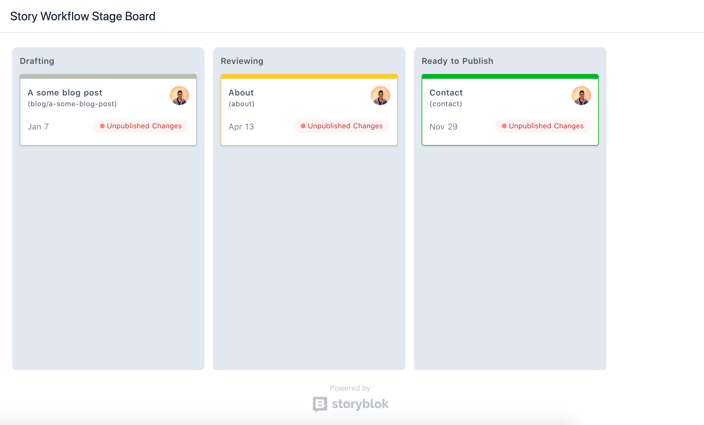

<p align="center">
  <h1 align="center">Storyblok Stage Kanban App</h1>
</p>



> Kanban app to change the Workflow Stage from a story

## Development

Firstly, to create an app on Storyblok, you need to enter to the [our partner program](https://www.storyblok.com/partners).

### Installation

``` bash
# clone this repository
$ git clone https://github.com/storyblok/storyblok-workflow-app.git

# install dependencies
$ yarn install # npm install
```

### Working on App in Development

To run the project in development, firstly, you need to configure our `nuxt-auth` module ([check out the documentation](https://github.com/storyblok/nuxt-auth)) with your oauth credentials (these credentials will be available on App Settings).

After this, you need to set the oauth URLs:

* `Url to your app` field: `<APP_URL>/auth/connect/storyblok`
* `Oauth2 callback url` field: `<APP_URL>/auth/callback` (this URL must be include in `redirect_uri` property in `nuxt-auth` module)

### Setup a SSH Environment

We recommend you to use [ngrok](https://ngrok.com/) to create a tunel to your development environment. In you terminal, execute:

```bash
$ ngrok http 3000 # the 3000 port is the Nuxt default
```

Use the ngrok URL in the previous fields (app URL, oauth callback URL)

### Check the App in Development

After all, start the Nuxt dev server in yout terminal,

```bash
$ yarn dev # npm run dev
```

And go to the a specific space on Storyblok and install the App in its space.

### Deploy

This app is like any other Nuxt app, so, the deploy is the same ([check the Nuxt documentation about this](https://nuxtjs.org/guide/commands#production-deployment)). **The only thing that you must be concern, is the URLs configurations**.

---

<p align="center">
  <h5 align="center">Powered by <a href="https://www.storyblok.com/" title="link to the Storyblok website">Storyblok</a></h5>
</p>
